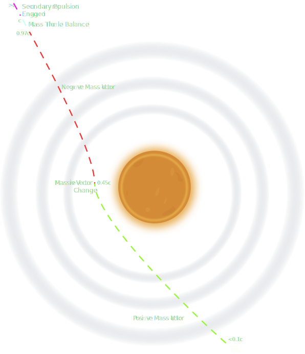

# Proposal to Fleet Control for inter-system transit

The ∅-Drive is a highly efficient drive that enables propulsion within gravity waves, and allows for the vacuum vessel to rendered into a net-zero mass system. This allows for faster than light travel with no theoretical bound, however physically limited by the acceleration time of the vessel, and the g-force that the vessel, and more limiting, the crew, can withstand. Hence, travel within any reasonable timeframe is limited by the acceleration-deceleration period of transit.

## Mass Dilemma

The current state of the ∅-Drive requires the gravity of the system star to propel the vessel to near light speed. However, in order to surpass the light speed barrier the negative mass of the ∅-Drive must completely negate the mass of the vessel. The primary issue that upon this circumstance, the ∅-Drive's propulsive force is entirely negated as it has no mass to participate in repulsion form the gravity waves.

All acceleration acquired beyond light speed must then be conducted by traditional propulsion. This may be spontaneous particle engine, ion engines, or ancient combustion thrusters.

> **Fuelled Propulsion**
> Methods of propulsion provided by expending some function of fuel must be exactly calibrated to the ∅-Drive's transience function such that the entire mass of the system remains 0

> **Spontaneous Particle Engine**
> A spontaneous particle engine operates by ejecting, matter-antimatter particle pairs prior to annihilation. Ejecting this material may provide thrust, while not changing the overall mass of the vessel, as no mass is ultimately gained or lost.

## Proposed Space Flight Pattern

