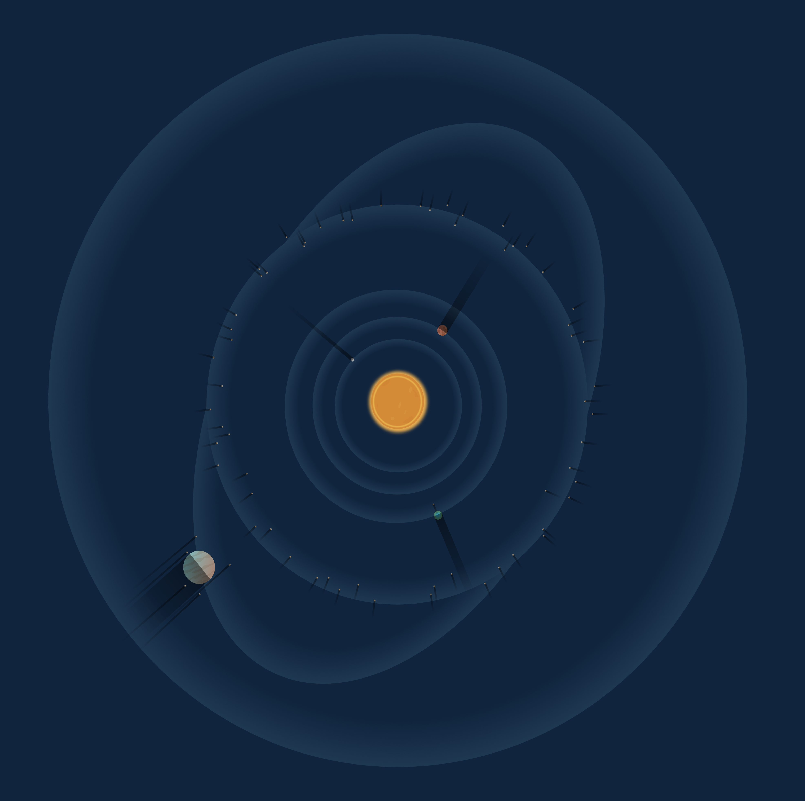

# Jarynt System

## Overview

The Jarynt System has four major orbitals surrounding its class K Main Sequence Star, and has favourable conditions to for recognisable life to that of home to be present. Hence, upon discovery, it was a priority candidate for an expedition to assess each planet for life.

The obvious candidate for an expedition[^1] was Lientsil. It is the 4th planet from the star and maintains a hot but tolerable 19°C average temperature. Lientsil showed a positive biomass reading. A notable moon in its L1 Lagrange point resulting in a permanent eclipse. This moon is about 1/3 of the apparent size of the sun, resulting in a flaming ring like view of the star during midday.

The two inner planets contain rocky planets. Karyt the innermost planet is a small high-spin planetoid with no atmosphere. Initial spectral analysis identified a strong heavy metal presence in Karyt's crust. The second planet is a large planet covered in a coarse low-density sediment. Permanent cyclonic effects within the ground result in tumultuous dust upheavals. When two large scale cyclonic-sediment-tsunamis collide, severe earthquakes are observed.

Jarynt would be likely unhibatible due to a proximal asteroid belt which should course frequent impact events on Lientsil's surface, however the asteroid belt, known as the Precipice Deep, is frequently visited by Hargratious, a supermassive gas giant that consumes its moons, only to get new ones when passing through the Precipice Deep twice-yearly.

[1]: The fourth expedition was tasked with exploring the planet Leintsil but due `corrupted $$ indexer skipping..` [Expedition 13](wca_expedition13_overview.md) was required for recovery.
